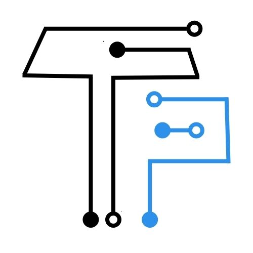
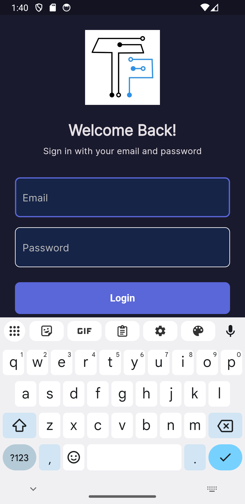

# 🚀 TechTutor Pro - Mobile Learning Platform

A modern, feature-rich mobile application for online education built with Flutter. TechTutor Pro provides a seamless learning experience with course browsing, purchasing, and interactive learning materials.



## ✨ Features

### 🎓 Learning Experience
- **Course Catalog**: Browse through a comprehensive collection of courses
- **Interactive Materials**: Access text-based content and video tutorials
- **Progress Tracking**: Monitor your learning progress across courses
- **Material Categories**: Organized content with expandable categories

### 💳 Payment & Transactions
- **In-App Purchases**: Secure payment system for course purchases
- **Transaction History**: Complete record of all purchases and payments
- **Payment Summary**: Detailed breakdown of transaction costs

### 👤 User Management
- **Authentication**: Secure login and registration system
- **Social Login**: Sign in with Google, Facebook, or GitHub
- **Profile Management**: Update personal information and preferences
- **Account Dashboard**: Centralized view of user activities

### 🎨 Modern UI/UX
- **Material Design 3**: Latest Material You design principles
- **Dark/Light Theme**: Adaptive theming for user preference
- **Responsive Design**: Optimized for various screen sizes
- **Smooth Animations**: Engaging micro-interactions and transitions

## 🛠 Tech Stack

- **Framework**: Flutter 3.x
- **State Management**: BLoC Pattern with flutter_bloc
- **Dependency Injection**: GetIt with Injectable
- **Navigation**: GoRouter for type-safe routing
- **HTTP Client**: Dio for API communication
- **Local Storage**: SharedPreferences for data persistence
- **Image Loading**: CachedNetworkImage for optimized image loading
- **Video Player**: YouTube Player Flutter for video content
- **Markdown Rendering**: Flutter Markdown for rich text content

## 📱 Screenshots

<div align="center">
  
</div>

## 🚀 Getting Started

### Prerequisites

- Flutter SDK (>=3.3.1)
- Dart SDK (>=3.3.1)
- Android Studio / VS Code
- Android SDK (for Android development)
- Xcode (for iOS development, macOS only)

### Installation

1. **Clone the repository**
   ```bash
   git clone https://github.com/yourusername/techtutorpro.git
   cd techtutorpro
   ```

2. **Install dependencies**
   ```bash
   flutter pub get
   ```

3. **Generate code** (if using code generation)
   ```bash
   flutter packages pub run build_runner build
   ```

4. **Run the app**
   ```bash
   flutter run
   ```

### Build for Production

**Android APK:**
```bash
flutter build apk --release
```

**Android App Bundle:**
```bash
flutter build appbundle --release
```

**iOS:**
```bash
flutter build ios --release
```

## 📁 Project Structure

```
lib/
├── core/                    # Core functionality
│   ├── constants/          # App-wide constants
│   ├── services/           # Core services
│   ├── theme/              # App theming
│   ├── utils/              # Utility functions
│   └── widgets/            # Shared widgets
├── features/               # Feature modules
│   ├── auth/              # Authentication
│   ├── courses/           # Course management
│   ├── dashboard/         # Main dashboard
│   ├── account/           # User account
│   ├── transaction/       # Payment & transactions
│   ├── onboarding/        # App onboarding
│   └── payment/           # Payment processing
├── l10n/                  # Localization
├── router/                # Navigation routing
├── injection.dart         # Dependency injection
└── main.dart              # App entry point
```

## 🏗 Architecture

TechTutor Pro follows **Clean Architecture** principles with the **BLoC pattern** for state management:

- **Presentation Layer**: UI components and BLoC/Cubit state management
- **Domain Layer**: Business logic, entities, and use cases
- **Data Layer**: Repositories, data sources, and models

### Key Design Patterns

- **Repository Pattern**: Abstract data access layer
- **Dependency Injection**: Using GetIt for service locator
- **Observer Pattern**: BLoC for reactive state management
- **Factory Pattern**: For creating complex objects

## 🧪 Testing

Run tests using the following commands:

```bash
# Unit tests
flutter test

# Widget tests
flutter test test/widget/

# Integration tests
flutter test test/integration/
```

## 📦 Dependencies

### Core Dependencies
- `flutter_bloc`: State management
- `get_it`: Dependency injection
- `go_router`: Navigation
- `dio`: HTTP client
- `shared_preferences`: Local storage
- `cached_network_image`: Image caching
- `flutter_markdown`: Markdown rendering
- `youtube_player_flutter`: Video playback

### Development Dependencies
- `flutter_lints`: Code linting
- `build_runner`: Code generation
- `injectable_generator`: DI code generation
- `flutter_native_splash`: Splash screen generation
- `flutter_launcher_icons`: App icon generation

## 🎨 Design System

### Colors
- **Primary**: `#5A67D8` (Blue)
- **Secondary**: `#7F9CF5` (Light Blue)
- **Accent**: Various vibrant colors for different features

### Typography
- **Primary Font**: Google Fonts Poppins
- **Secondary Font**: Google Fonts Inter

### Components
- Material 3 design components
- Custom rounded cards and buttons
- Gradient backgrounds
- Neumorphic shadows

## 🔧 Configuration

### API Configuration
Update API endpoints in the data sources:
- `lib/features/courses/data/datasources/course_remote_datasource.dart`
- `lib/features/auth/data/datasources/`
- `lib/features/transaction/data/datasources/`

## 📄 License

This project is licensed under the MIT License - see the [LICENSE](LICENSE) file for details.

## 🤝 Contributing

1. Fork the repository
2. Create your feature branch (`git checkout -b feature/AmazingFeature`)
3. Commit your changes (`git commit -m 'Add some AmazingFeature'`)
4. Push to the branch (`git push origin feature/AmazingFeature`)
5. Open a Pull Request

### Code Style
- Follow Dart/Flutter conventions
- Use meaningful variable and function names
- Add comments for complex logic
- Write unit tests for business logic

## 🙏 Acknowledgments

- Flutter team for the amazing framework
- Material Design team for design guidelines
- All contributors and beta testers

---

<div align="center">
  <p>Made with ❤️ by the TechTutor Pro Team</p>
  <p>Built with Flutter</p>
</div>
